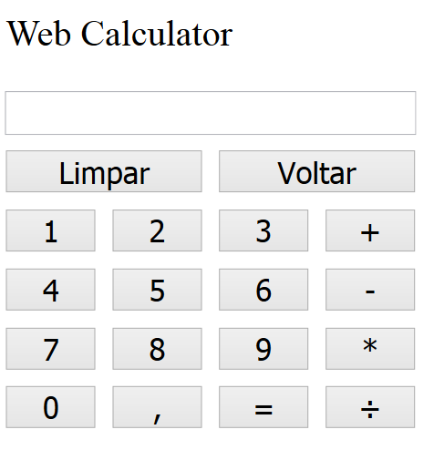

# Web Calculator

Este é um primeiro projeto, que pode parecer meio pequeno sim, mas que é para começar a criar experiência na linguagem JavaScript.

Web Calculator é uma simples calculadora, que executa as quatro operações básicas (adição, subtração, multiplicação e divisão).

E enquanto faz as contas, há dois botões de funções específicos: 'Limpar' e 'Voltar'. Eles servem para 'limpar' a calculadora, números digitados e operadores, e voltar dígitos que podem ter sido digitados incorretamente.

## Imagem do Software

## Uso

Para usar a aplicação:

  1. Fazer o download: Duas formas de baixar o sistema:
  
    - Baixando o ZIP diretamente do repositório, ou;
    - Fazendo o clone deste repositório, através do comando:
    git clone https://github.com/rt-oliveira/Web-Calculator.git
    
  2. Abrir o arquivo *index.html*, e;
  
  3. Está pronto para ser usado o Web Calculator.
  
## Contribuições
  

